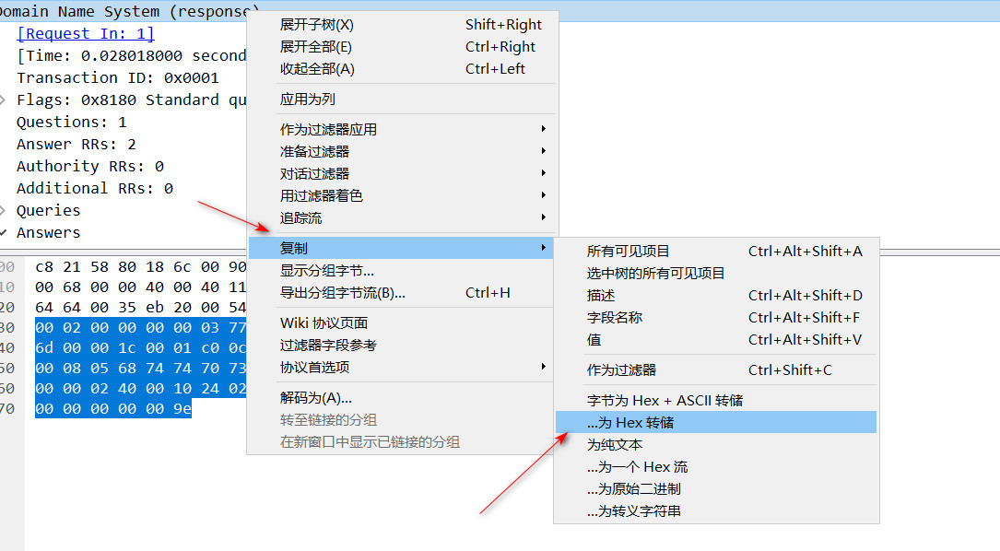

# Wireshark数据包处理工具
-----------------------------------
用于将Wireshark中16进制数据包转换为Python的字节序列,进行后续差异比较。  
使用方法如下:

  

将复制到的文本传入到函数中,即可得到对应的字节序列:  

```
from wireshark_ext import copy_from_wireshark

raw = """0000   10 32 81 80 00 01 00 01 00 00 00 00 06 67 6f 6f
         0010   67 6c 65 03 63 6f 6d 00 00 10 00 01 c0 0c 00 10
         0020   00 01 00 00 01 0e 00 10 0f 76 3d 73 70 66 31 20
         0030   70 74 72 20 3f 61 6c 6c
      """
py_byte = copy_from_wireshark(raw)
print(py_byte)
```

此时将得到类似如下的结果:  

<pre>
'\x102\x81\x80\x00\x01\x00\x01\x00\x00\x00\x00\x06google\x03com\x00\x00\x10\x00\x01\xc0\x0c\x00\x10\x00\x01\x00\x00\x01\x0e\x00\x10\x0fv=spf1 ptr ?all'
</pre>

如果将上述的字节序列传入到如下的`convert_to_wireshark`函数中即可得到与Wireshark中一样的格式:  

```
packet = '\x102\x81\x80\x00\x01\x00\x01\x00\x00\x00\x00\x06google\x03com\x00\x00\x10\x00\x01\xc0\x0c\x00\x10\x00\x01\x00\x00\x01\x0e\x00\x10\x0fv=spf1 ptr ?all'
data = convert_to_wireshark(packet)
print(data)
```

此时将得到如下格式化的结果:  

<pre>
0000   10 32 81 80 00 01 00 01 00 00 00 00 06 67 6f 6f
0010   67 6c 65 03 63 6f 6d 00 00 10 00 01 c0 0c 00 10
0020   00 01 00 00 01 0e 00 10 0f 76 3d 73 70 66 31 20
0030   70 74 72 20 3f 61 6c 6c
</pre>

从而可以对比自己的得到的结果是否与Wireshark的一致。  
